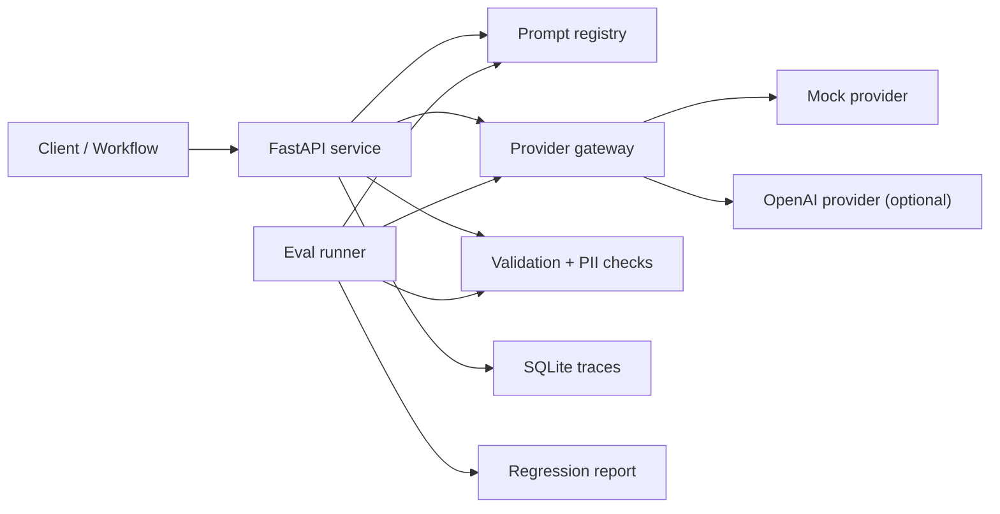

# llm-platform-starter

A minimal shared AI platform for routing model calls, tracking prompts, evaluating outputs, enforcing guardrails, and logging cost and latency.

This project demonstrates the internal platform layer teams need once LLM usage moves beyond one-off prompts. It is intentionally small, public-safe, and built around synthetic support-ticket classification examples.

## What It Shows

- Provider gateway with a deterministic mock provider and optional OpenAI provider
- Prompt registry with versioned templates stored as JSON
- Evaluation harness for regression checks across prompt and model versions
- Guardrails using Pydantic schema validation and simple PII detection
- SQLite trace logging for request, latency, token, cost, validation, and error metadata
- FastAPI service surface for an example ticket-classification workflow
- Documentation for architecture, tradeoffs, eval methodology, failure modes, and roadmap

## Quick Start

```bash
python -m venv .venv
.venv\Scripts\activate
pip install -e ".[dev,api]"
pytest
```

Run the API:

```bash
uvicorn llm_platform_starter.api:app --reload
```

Try a classification request:

```bash
curl -X POST http://127.0.0.1:8000/classify-ticket ^
  -H "Content-Type: application/json" ^
  -d "{\"subject\":\"Refund request\",\"body\":\"Customer asks for a refund after duplicate billing.\"}"
```

Run evals:

```bash
python -m llm_platform_starter.evals.runner
```

## Architecture



See [docs/architecture.md](docs/architecture.md) for the system design and [docs/tradeoffs.md](docs/tradeoffs.md) for what is intentionally deferred.

## Example Task

The included example classifies synthetic support tickets into:

- `billing`
- `technical`
- `account`
- `general`

The output schema also captures severity, confidence, and whether a human review is needed.

## Portfolio Positioning

This is not a toy chatbot. It is a compact platform slice showing how a senior AI/data platform engineer thinks about repeatability, versioning, reliability, evaluation, operational metadata, and public-safe delivery.

## Project Status

MVP scaffold complete:

- deterministic provider path for local tests
- versioned prompt loading
- ticket-classification workflow
- guardrail validation
- trace persistence
- eval runner
- test suite
- CI workflow

Planned next steps are tracked in [docs/roadmap.md](docs/roadmap.md).
